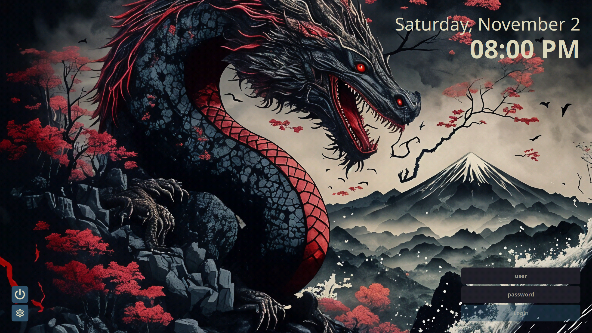

# Kanagawa dragon

A [SDDM](https://github.com/sddm/sddm) theme that places controls on your screen corners.

</img>

I couldn't really find a preexisting theme that I liked, so I made my own. Layout inspired by [sddm-theme-corners](https://github.com/aczw/sddm-theme-corners).

#### Wallpaper

I am not the [original artist](https://displate.com/laurenakaety) of the image, i just created an upscaled version. The original image can be found [here](https://displate.com/displate/6465315).

## Dependencies

This theme does not require KDE Plasma, so make sure you have Qt 5 installed!

- SDDM
- Qt 6
- Qt SVG
- Qt 5compat

On Arch, run

```sh
pacman -Syu sddm qt6 qt6-svg qt6-5compat
```

## Installation

Download/clone this repo, and copy the `kanagawa-dragon/` folder to `/usr/share/sddm/themes/`.

```sh
git clone https://github.com/marcosvnmelo/sddm-kanagawa-dragon-theme
cd sddm-kanagawa-dragon-theme/
sudo cp -r kanagawa-dragon/ /usr/share/sddm/themes/
```

## Configuration

Font, colors, size, corner radius, and more can all be configured. Please see [CONFIG.md](CONFIG.md) for a description of what each option does!

If you haven't already, make sure to change the current theme that SDDM is using. On Arch, create a `.conf` file in `/etc/sddm.conf.d/` with the following contents:

```conf
[Theme]
Current=kanagawa-dragon
```

Check the [Arch Wiki](https://wiki.archlinux.org/title/SDDM#Configuration) for more info.

You'll definitely want to configure the theme before using it. Out of the box it uses [Noto Sans](https://fonts.google.com/noto/specimen/Noto+Sans) for the font.

Edit `theme.conf` (inside `kanagawa-dragon/`) as you see fit.

## License

This project is licensed under GPLv3. Check it out [here](LICENSE).

## Thanks!

That's pretty much it :) I hope you enjoy the theme. Feedback is much appreciated!!
